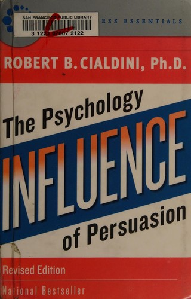

<!-- _class: lead -->
<!-- _paginate: false -->
<!-- _footer: "" -->

# I Knocked on 1000 Doors So You Don't Have To

## Selling anything, from doorbells to DMs

<!--
Open here. "Everyone in this room is already a salesperson — you sell yourself in every interview, every pitch to your parents. Today I want to make you good at it on purpose."
Frame: the MEDIUM of selling changed completely in 30 years. The human on the other side did not. Master the human and you can sell in any era.
~45 min talk + role-play at the end.
-->

---

<!-- _class: statement -->

# Everyone is always selling something.

<!--
The single most underrated skill in entrepreneurship is sales.
Most technical founders can build anything and sell nothing — and their company dies with a great product nobody bought.
If you can sell, you will never starve. Most transferable skill there is.
-->

---

## You're always selling **you**.

Not everyone here will start a company.
**Everyone** here will sell themselves.

- In every **interview**
- As a **founder** — your vision, to customers and investors
- As an **intrapreneur** — your ideas, inside someone else's company

<!--
Important for this room: I know not everyone here plans to do a startup. Doesn't matter.
Whether you become a founder pitching investors, or an intrapreneur pitching your boss on a new project, or a new grad in a job interview — you are selling yourself. Constantly.
An interview IS a sales call: you are the product, and you're persuading them to "buy." Everything today applies to you whether or not you ever start a company.
-->

---

## I volunteered to knock on doors.

**Two months · Verizon 5G internet · door-to-door**

<!--
My confession: between submarine assignments, I voluntarily did door-to-door sales for Verizon 5G internet for two months.
I didn't need the money. I wanted the REPS — to know what it felt like to get rejected to my face over and over and keep going.
Engineers and military officers are not "natural salespeople." I built the muscle on purpose, like any other skill.
-->

---

<!-- _class: statement -->

# 50 "no"s in an afternoon.
### Then you ring the next bell.

<!--
The real lesson of the doorstep: detachment from outcome.
You will hear "no" far more than "yes." If each no wounds you, you quit. If you treat it as data, you win.
This is the emotional core of all sales and all entrepreneurship: volume + resilience.
-->

---

<!-- _class: divider -->

### Part 1
# The evolution of the sale

<!--
Watch the CHANNEL move through four eras — but the underlying principles never move.
-->

---

<!-- _class: divider -->

### Era 1
# The marketplace
*In person. Face to face.*

<!--
The bazaar, the general store, the handshake.
Sam Walton — Made in America — built the biggest retailer on earth by walking his own store floors, watching customers.
Lesson that survives every era: relentless customer obsession. Go where the customer is and watch them.
-->

---

<!-- _class: divider -->

### Era 2
# Door-to-door
*You are interrupting dinner.*

<!--
My Verizon stint lives here.
About 7 seconds before they decide. Tonality, posture, and your first sentence are everything.
HOW you say it beats WHAT you say. People buy the energy before they buy the offer.
-->

---

<!-- _class: divider -->

### Era 3
# The phone
*Cold calls and scripts.*

<!--
Phone sales: volume, scripts, objection handling at scale.
Not ancient history — I cold-call small businesses TODAY for my AI receptionist startup.
The phone removed the walk between doors. You "knock" far faster.
-->

---

<!-- _class: divider -->

### Era 4
# Digital
*The doorbell became a button.*

<!--
Landing pages, email, DMs, ads.
The doorbell turned into a "Notify me" button. You can knock on 10,000 doors while you sleep.
The leverage explosion — available to a 19-year-old with a laptop. That's new in history.
-->

---

<!-- _class: statement -->

# The channel changed.
# The human didn't.

<!--
The through-line of the entire talk. Tattoo it on your brain.
Every era rewards the same two things: earning attention, and reducing the friction to "yes."
Learn the human and you are future-proof, whatever the next channel is.
-->

---

<!-- _class: divider -->

### Part 2
# How you actually take money
*…and measure demand*

<!--
The practical, do-it-this-week mechanics. Where ideas become businesses.
-->

---

## Accept payment **before** you build.

A single Stripe link. That's it.

<!--
Biggest beginner mistake: build for 6 months, THEN try to sell.
Flip it. Put up a payment link or pre-order first. If people pay, you have a business. If they won't, you just saved 6 months.
-->

---

<!-- _class: statement -->

# If they won't pay,
# it's a hobby — not a business.

<!--
Harsh but freeing.
"I'd totally buy that" is worthless. A credit card number is truth.
Money is the only honest vote.
-->

---

## "Be the first to find out."

A one-page site. An email box. Real demand.

<!--
Cheapest market test on earth: a one-page site, "Be the first to know when it goes live," with an email capture.
Real emails from strangers >> polite encouragement from friends.
Validate an idea this weekend for $0 before writing a line of product.
-->

---

## Pre-sells beat surveys.

A deposit is the only honest survey.

- Tesla Roadster — **$5,000 due today** to reserve
- Cybertruck, Semi — same playbook
- Facebook — wait in line for an invite
- Books — pre-order before they're printed

<!--
Surveys lie because saying yes is free. A pre-order/deposit costs the customer something, so it tells the truth.
Tesla took $5,000 deposits for a Roadster that didn't exist yet — did the same with Cybertruck and the Semi. Facebook made you wait in line for an invite (scarcity + demand signal). You can pre-order a book before it's printed.
All of these collect real money or real commitment BEFORE building. That's the move.
Tie to Ready, Fire, Aim (Masterson): get something real in front of a customer fast.
DROP IN: a screenshot of tesla.com/roadster/reserve (#payment) showing the Roadster + "$5,000 due today". Save as images/tesla-roadster-reserve.png, then add this line to the slide: 
-->

---

<!-- _class: divider -->

### Part 3
# The Hormozi map
*Four ways to get a customer*

<!--
From Hormozi's $100M Leads. Exactly four lanes to get customers. Just four. Everything is a version of these.
-->

---

## Four lanes. Only four.

| | **Warm** | **Cold** |
|---|---|---|
| **1-to-1** | Warm outreach | Cold outreach |
| **1-to-many** | Content | Paid ads |

<!--
Two questions define every lane: Do they already know you (warm vs cold)? Are you reaching one person or many (1-to-1 vs 1-to-many)?
Walk the grid. We'll take each corner in turn.
-->

---

## Warm outreach
**Start here. It's free.**

<!--
Texting/calling people who already know you. Your "100-person list."
Free, converts best, where almost everyone should start. Beginners skip it because selling to people you know feels uncomfortable.
-->

---

## Cold outreach
*My daily reality.*

<!--
Cold calls, cold DMs, cold email to strangers.
What I do every day for my startup right now.
Formula: volume × personalization × follow-up. Most of the money is in the follow-up — people quit after one touch.
-->

---

## Content
**Sells while you sleep.**

<!--
One-to-many, warm. Posting free, useful content that builds an audience.
I made a YouTube video about a tool I built — it keeps selling my work while I sleep. Compounding leverage.
-->

---

## Paid ads
*Buy attention — last.*

<!--
One-to-many, cold. Renting attention with money.
Only turn this on AFTER your offer already converts organically. Ads pour fuel on a fire; no fire = you just burn cash.
-->

---

<!-- _class: statement -->

# Saturate ONE lane
# before you add a second.

<!--
The beginner death is doing all four badly.
Pick one lane. Go deep until it's predictable. THEN add the next. Focus beats diversification when you're small.
-->

---

<!-- _class: divider -->

### Part 4
# The psychology that never changes

<!--
The channel changes; the brain does not. Robert Cialdini's principles of influence — 40+ years old and still running the show.
This book — Influence — is the bible. Hold it up. We'll walk the principles in the order I memorize them.
-->

---

<!-- _class: principle -->

🤝

## Reciprocity

Give first.

<!--
#1. When you give value first — a free teardown, a useful tip — people feel a pull to give back.
This is why "free value" outreach beats "buy my thing" outreach.
-->

---

<!-- _class: principle -->

😊

## Liking

Bring joy and people buy from you.

<!--
#2 — and the one with my best story.
People buy from people they like. The fastest way to be liked: bring light to someone's day.
THE DOORSTEP STORY: I was on a long streak of people saying "no, not interested" before I could even start. So I went off-script — before saying anything about myself, I'd compliment something: their house, their car, their garden. Even an ugly, unmaintained house: "I love the color of these bricks — looks sturdy and earthy." The tone flips instantly the moment you give a genuine compliment. Suddenly they'll talk to you.
Picture two fruit kiosks side by side — one clerk smiling, one frowning. You buy from the smiling one every time.
OPTIONAL IMAGE: drop a two-fruit-kiosk image (smiling vs frowning clerk) into images/liking-kiosks.png and swap the emoji.
-->

---

<!-- _class: principle -->

👥

## Social proof

"Join 400 others."

<!--
#3. People look to others to decide what's safe. Testimonials, user counts, reviews, logos.
Nobody wants to be first; everybody wants to be 401st.
-->

---

<!-- _class: principle -->

🎓

## Authority

Be the obvious expert.

<!--
#4. Credentials and demonstrated expertise make people defer.
Earn it and show it. (We'll see the DARK side of authority in the Incentives session — the doctor in the white coat.)
-->

---

<!-- _class: principle -->

⏳

## Scarcity

Real deadlines. Real limits.

<!--
#5. Limited slots and real deadlines create urgency. KEY WORD: real. Fake scarcity gets sniffed out and destroys trust.
-->

---

<!-- _class: principle -->

✅

## Consistency

Small yes → big yes.

<!--
#6. People act consistently with what they've already done. A small commitment (that email opt-in!) makes the next, bigger yes far more likely.
The opt-in isn't just a lead — it's a first small yes.
-->

---

<!-- _class: principle -->

🫂

## Unity

"People like us."

<!--
#7, Cialdini's newest. Shared identity — "we're the same kind of people." Family, team, hometown, alma mater.
The deepest pull: not "people I like," but "people who ARE me." Find the real shared identity.
-->

---

## It all stems from one habit.

> Seek first to understand,
> then to be understood.

— 7 Habits, Habit 5

<!--
The secret the slick tactics miss. Covey's Habit 5.
The best closers ASK more than they pitch. Diagnose before you prescribe. People don't care what you sell until they feel understood.
All seven principles land 10x harder once the person feels heard.
-->

---

## Think win/win.

The sale that screws the customer kills the next ten referrals.

<!--
Covey Habit 4. (48 Laws of Power teaches leverage — useful to understand — but in business, repeat games beat one-shot games.)
A win/win sale compounds into referrals. A win/lose sale is a dead end. Play long games.
-->

---

<!-- _class: statement -->

# Tactics without trust
# is just manipulation.

<!--
The line between a great salesperson and a sleazy one.
Same principles. The difference: are you helping the customer reach THEIR goal, or tricking them toward yours?
Reinforce with the classics — Ziglar: help enough others get what they want; Bettger: enthusiasm + questions; Tracy: 80% of selling is psychology; Holmes: pigheaded discipline on the fundamentals.
-->

---

<!-- _class: divider -->

### Part 5
# My reps, unfiltered

<!--
Two honest stories so this isn't theory.
-->

---

## The Verizon doorstep
*Detachment from outcome.*

<!--
A specific rough afternoon of rejections, and the moment I stopped taking the no's personally and my numbers improved.
The no's are the job. Detach and keep moving.
-->

---

## Navy recruiting
*The hardest product on earth.*

<!--
I sell the hardest "product" there is — asking a teenager and their parents to commit years of their life to the military.
No refund, huge stakes, deeply emotional. If you can sell that ethically, you can sell anything.
-->

---

<!-- _class: divider -->

### Your turn
# Sell me something

<!--
Transition to the interactive part. Energy up.
-->

---

## 30-second pitch.
I'll object. We fix it together.

<!--
Pick 2-3 volunteers. Each pitches a real or made-up product in 30 seconds.
I raise a real objection. Then we repair it live using today's frameworks — which lane, which lever, which principle, did they seek to understand first.
-->

---

<!-- _class: lead -->
<!-- _footer: "" -->

# This week:
# put up a "notify me" page.
## Send 10 warm-outreach messages.

<!--
Homework / close.
1. Stand up a one-page opt-in for ANY idea this week.
2. Send 10 warm-outreach messages to people who know you.
Report back next session.
Closing line: "You don't need permission and you don't need a finished product. You need a doorbell and the nerve to ring it. Now go ring."
-->
